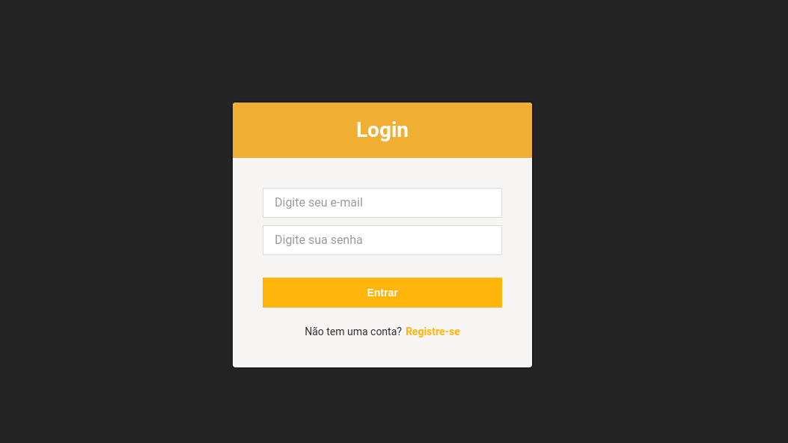
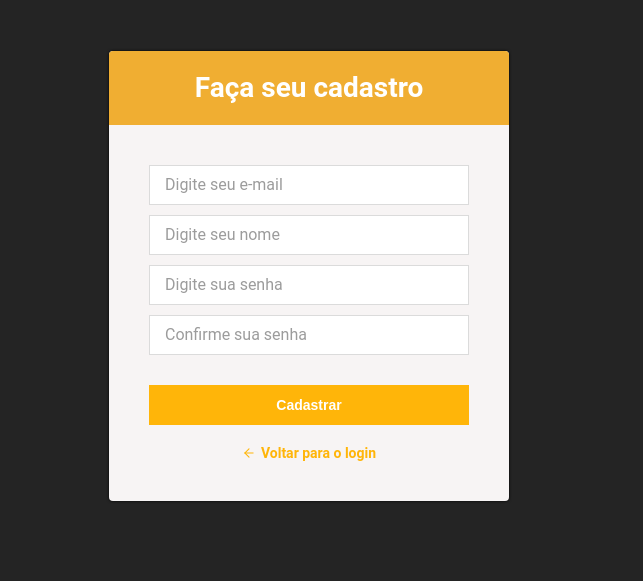
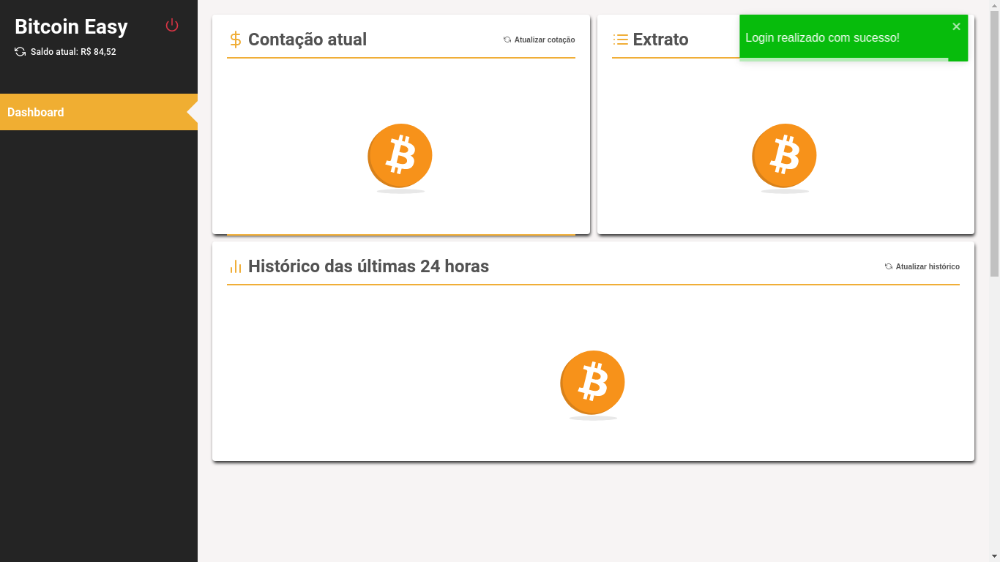
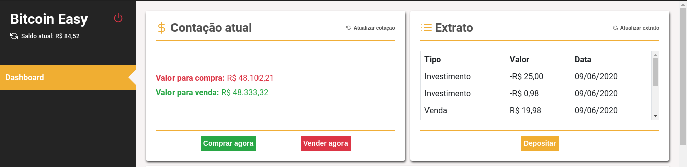
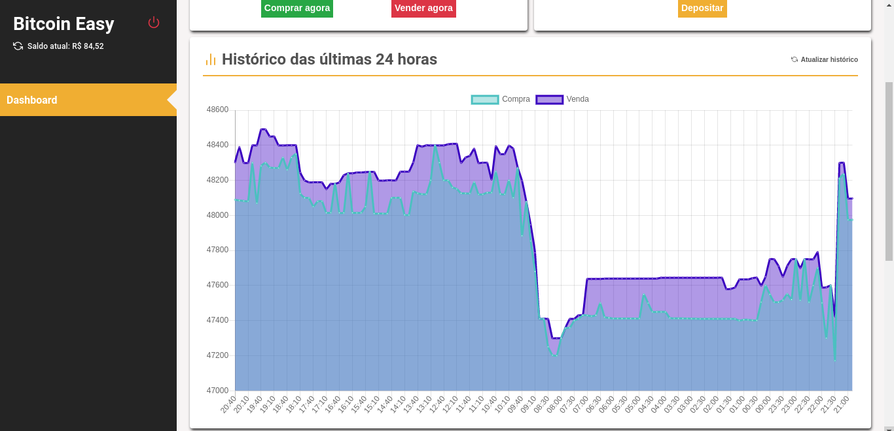
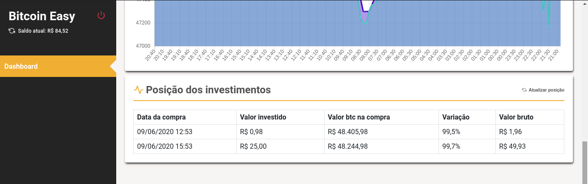

<h1 align="center">
  
</h1>

<h4 align="center">
	Bitcoin Easy
</h4>

<p align="center">
  

  

  <a href="https://www.linkedin.com/in/lucasdeveloperti/">
    
  </a>

  <a href="https://github.com/lucas-eduardo/bitcoin-easy/commits/master">
    
  </a>

  

   <a href="https://github.com/lucas-eduardo/bitcoin-easy/stargazers">
    
  </a>
</p>

## 💻 Sobre o projeto

💰 Bitcon Easy - É um desafio para criação de um painel para depositar, investir e vender bitcoin.

Especificações

<strong>Contas</strong>

- [x] Permitir cadastro (nome, email e senha)
- [x] Permitir login (e-mail e senha) e armazenar o token JWT para os demais requests

<strong>Dashboard</strong>

- [x] Deve exibir o saldo disponível em reais na conta do cliente
- [x] Cotação atual do bitcoin, compra e venda
- [x] Histórico: Deve exibir um gráfico o histórico de valor de compra/venda do bitcoin que retorne o valor com frequência de 10 minutos (8:00, 8:10, 8:20, ...) das últimas 24 horas.
- [x] Posição dos investimentos: O Cliente deve poder ver a posição de seus investimentos com as informações: data de compra, valor investido, valor do btc no momento da compra, percentual de variação do preço do bitcoin e valor bruto atual do investimento

<strong>Depósitos</strong>

- [x] Deve poder fazer depósitos de valores em reais

<strong>Compra</strong>

- [x] Deve poder fazer compras de bitcoins usando seu saldo disponível na conta

- [x] Deve ser exibido um preview com a estimativa antes da confirmação da compra

<strong>Venda</strong>

- [x] Deve poder vender seus bitcoins com o valor em reais

<strong>Extrato</strong>

- [x] Deverá ser possível listar os depósitos, compras e resgates, com suas respectivas datas

---

## 🎨 Layout

<p align="center" style="display: flex; align-items: flex-start; justify-content: center;">
  

  

  

  

  

  
</p>

---

## 🛠 Tecnologias

As seguintes ferramentas foram usadas na construção do projeto:

- [React][reactjs]
- [TypeScript][typescript]

### Pré-requisitos

Antes de começar, você vai precisar ter instalado em sua máquina as seguintes ferramentas:
[Git](https://git-scm.com), [Node.js][nodejs] e [Yarn][yarn].
Além disto é bom ter um editor para trabalhar com o código como [VSCode][vscode]

### 🧭 Rodando a aplicação

```bash
# Clone este repositório
$ git clone https://github.com/lucas-eduardo/bitcoin-easy

# Acesse a pasta do projeto no seu terminal/cmd
$ cd bitcoin-easy

# Instale as dependências
$ yarn install

# Execute a aplicação em modo de desenvolvimento
$ yarn start

# A aplicação será aberta na porta:3000 - acesse http://localhost:3000
```

[nodejs]: https://nodejs.org/
[typescript]: https://www.typescriptlang.org/
[reactjs]: https://reactjs.org
[yarn]: https://yarnpkg.com/
[vscode]: https://code.visualstudio.com/
[license]: https://opensource.org/licenses/MIT
